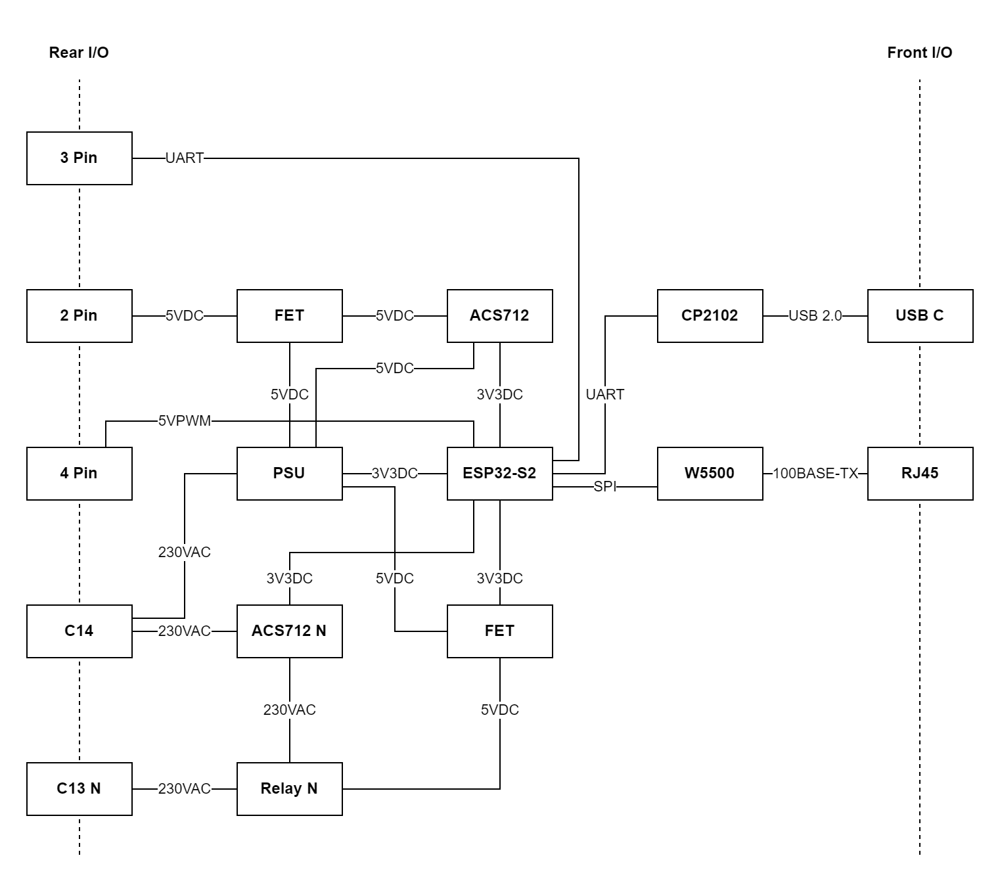

# Zeus ⚡

Zeus is an hardware platform for power monitoring and management. It is built around the ESP32. The idea is to add power monitoring for devices that do not support it natively. The metrics are collected and then exposed via endpoints that can be scraped by Prometheus.

## Concept 💡

The block diagram illustrates the core components of the hardware platform. The rear will feature a single C14 plug for power input as well a multiple C13 power outputs. All outputs will have seperate power monitoring circuits, allowing distinct power monitoring. In addition to that, the back features a 3-pin header for 3V3 UART communication to an external device. To allow for power control of that device, the back also features a 2-pin header for 5V power control. As the external device may need cooling the rear also features a 4-pin 5V PWM header. The duty may either be statically set or configured to follow the power consumption of the external device. In the front, the device will feature an RJ45 connector for Ethernet 100Base-TX Ethernet and a USB 2.0 type C port for programming and a serial console.

